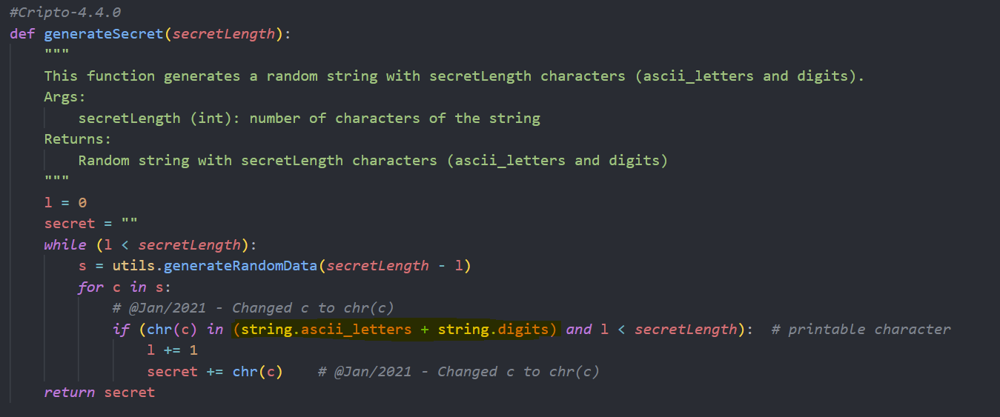
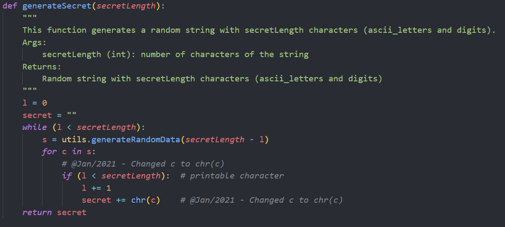
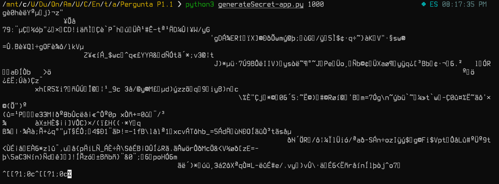
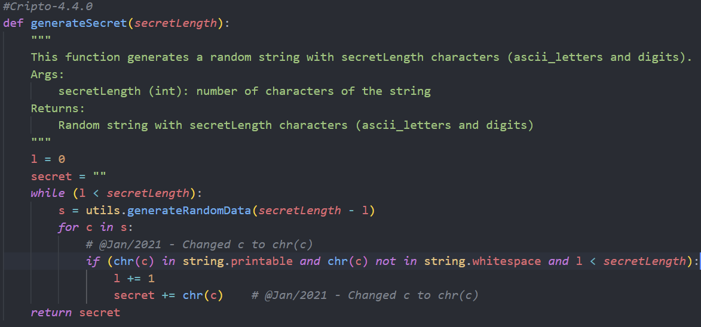
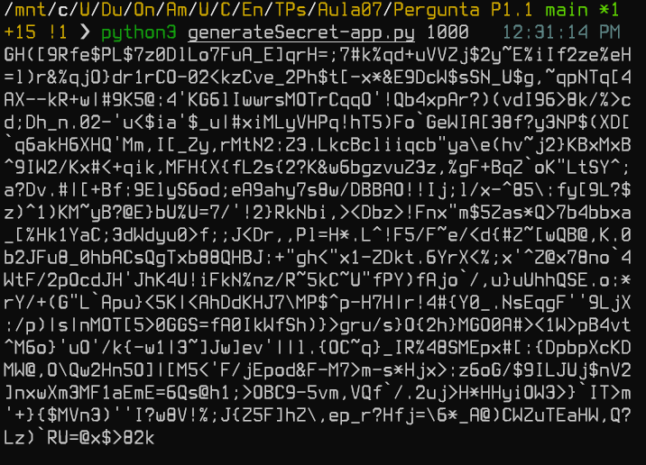

# Pergunta P1.1

##### 1. Analise e execute esse programa de geração de segredo aleatório e indique o motivo do output apenas conter letras e dígitos (não contendo por exemplo caracteres de pontuação ou outros).

Após a observação e interpretação do código fornecido, verifica-se, conforme comprovado pelo anexo de seguida apresentado, que a função **generateSecret** verifica se os caractéres gerados são letras ou digitos, excluindo os que não pertencem a estes grupos. Por esse motivo, os caracteres que são gerados vão obviamente ser só números e letras, não contendo acentuação ou outros tipos de caractéres. 




##### 2. O que teria de fazer para não limitar o output a vogais e dígitos? Altere o código.

Visto que não tínhamos a certeza da forma mais correta de fazer este exercício, tomamos a liberdade de fazer de duas formas diferentes.
Numa das alternativas, de modo a que se gerasse uma chave composta não exclusivamente por letras e números, bastou remover a condição que fazia essa verificação. Assim, o output e a alteração feita são apresentados de seguida.
<br>
A alteração no código:

O output:

Visto que não apreciámos o facto de se utilizarem espaços, e de forma a ter mais controlo sobre o tipo de caractéres gerados decidimos definir de outra forma esta condição. Por isso, na outra alternativa alteramos o **if** para verificar se o caractér é um digito, *ascii_letter* ou pontuação, definindo também uma restrição de modo a que não seja um espaço.
<br>
A alteração no código:

O output:



# Pergunta P2.1

##### A. Analise e execute esses programas, indicando o que teve que efectuar para dividir o segredo "Agora temos um segredo extremamente confidencial" em 7 partes, com quorom de 3 para reconstruir o segredo, assim como posteriormente para o reconstruir.

Para construir o segredo, tivemos que, primeiro que tudo, gerar uma chave privada e o correspondente certificado. PAra isso usamos os comandos sugeridos no enunciado e que já tinham sido vistos nas aulas teóricas. <br>

Depois, procedemos à utilização do programa `createSharedSecret-app.py`. Para isso, usamos o seguinte comando no terminal:

```
python3 createSharedSecret-app.py 7 3 "secretid" private-key.pem
```

Indicando, de seguida, a palavra passe usada na geração da chave, e o segredo a dividir.
Obtemos, assim, 7 componentes do segredo e guardamo-las. <br>

Para proceder à reconstrução do segredo, usamos então o programa `recoverSecretFromComponents-app.py` e `recoverSecretFromAllComponents-app.py`. Para isso, foram usados os seguintes comandos:

-   ```
    python3 recoverSecretFromComponents-app.py 3 "secretid" mykey.crt
    ```

    Utilizando este programa, é possível reconstruir o segredo com um número de componentes maior ou igual ao quorum com o qual o segredo partilhado foi construído inicialmente, neste caso, o quorum foi 3. 
    
    ```
    mel@MEIAVIDA ShamirSharing % python3 recoverSecretFromComponents-app.py 3 "secretid" mykey.crt
    Component 1: 
    Component 2: 
    Component 3: 
    Recovered secret: "Agora temos um segredo extremamente confidencial"%
    ```
    
    Se tentarmos reconstruir o segredo com um número de componentes menor que 3, o _output_ dado é um erro:

    ```
    mel@MEIAVIDA ShamirSharing % python3 recoverSecretFromComponents-app.py 2 "secretid" mykey.crt
    Component 1: 
    Component 2: 
    Error: The number of shares is less than quorum % 
    ```


-   ```
    python3 recoverSecretFromAllComponents-app.py 7 "secretid" mykey.crt
    ```

    Com este programa, já não é possível reconstruir o segredo com um número de componentes menor que o total, ou seja, neste caso, a construção do segredo partilhado foi feita com a divisão do mesmo em 7 partes, logo, para reconstruir o segredo com este programa, são necessárias todas as 7 componentes geradas na cosntrução.
    
    ```
    mel@MEIAVIDA ShamirSharing % python3 recoverSecretFromAllComponents-app.py 7 "secretid" mykey.crt
    Component 1: 
    Component 2: 
    Component 3: 
    Component 4: 
    Component 5: 
    Component 6: 
    Component 7: 
    Recovered secret: "Agora temos um segredo extremamente confidencial"%  
    ```
    
    Se tentarmos reconstruir o segredo com um número de componentes menor que o total e maior que o quorum (3), obtemos uma mensagem de erro:

    ```
    mel@MEIAVIDA ShamirSharing % python3 recoverSecretFromAllComponents-app.py 3 "secretid" mykey.crt
    Component 1: 
    Component 2: 
    Component 3: 
    Error: Invalid number of components% 
    ```


##### B. Indique também qual a diferença entre recoverSecretFromComponents-app.py e recoverSecretFromAllComponents-app.py, e em que situações poderá ser necessário utilizar recoverSecretFromAllComponents-app.py em vez de recoverSecretFromComponents-app.py.

A diferença entre estes dois programas acabou por ser referida já na resposta à alínea anterior. Em resumo, a diferença é que, utilizando o programa `recoverSecretFromComponents-app.py`, é possível reconstruir o segredo com um mínimo de 3 componentes (quorum), enquanto que com o programa `recoverSecretFromAllComponents-app.py`, são necessárias todas as partes para a reconstrução. <br>

Finalmente, o programa `recoverSecretFromAllComponents-app.py` poderá ser necessário em vez do `recoverSecretFromComponents-app.py` em situações em que se pretenda que o segredo seja reconstruído apenas pelo conjunto total de partes em que foi dividido. Ao pensar sobre este assunto, surgiu-nos o exemplo de uma conta bancária, onde é possível existir mais que um titular e, quando tal acontece, há algumas ações que só podem ser efetuadas pelo conjunto total dos titulares, nesses casos, o programa `recoverSecretFromAllComponents-app.py` seria necessário.

# Pergunta P3.1

> Grupo 7 e 8 - E&M (Encrypt-and-MAC) em Python

O programa desenvolvido é o ficheiro com o nome `E&M.py`.

O programa recorre a um menu que permite cifrar, validar e decifrar um ficheiro cifrado com uma técnica de _Authenticated Encryption_.

Para a validação do ficheiro, assumimos que o que se pretende é validar a estrutura do ficheiro cifrado, ou seja, validar que o MAC (no nosso caso, representado por "signature" no ficheiro cifrado) está presente no ficheiro a validar.

Utilizamos o algoritmo AES-GCM para cifrar e decifrar, necessitando, por isso, de guardar também no ficheiro cifrado o IV (vetor de inicialização) usado na cifra. Com este modo (GCM), na cifra já é feita uma espécie de autenticação do criptograma e é gerada uma _tag_. Para a decifra é necessário conhecer essa _tag_, por isso, esta é guardada também no ficheiro cifrado.

Este modo não necessita de meios adicionais para autenticação, no entanto, achamos por bem adicionar, de modo a poder também perceber como é que o HMAC funciona na prática.

# Pergunta P4.1

> Grupo 8 - Portugal, para a EC "ACIN iCloud Solutions, Lda"

Tal como sugerido no enunciado, começamos por aceder ao link fornecido e seguir o caminho até aos EC "ACIN iCloud Solutions, Lda".

Depois, copiamos o conteúdo do _Base 64-encoded_ e guardamos num ficheiro "cert.crt" da forma indicada no enunciado.

Executamos, então, o comando openssl `x509 -in cert.crt -text -noout`, cujo resultado apresentamos de seguida.

```
mel@MEIAVIDA Aula07.2022Abr5 % openssl x509 -in cert.crt -text -noout
Certificate:
    Data:
        Version: 3 (0x2)
        Serial Number:
            1e:0a:5a:4e:b2:45:99:3c:5e:b9:2f:31:48:db:0c:f6
        Signature Algorithm: sha256WithRSAEncryption
        Issuer: C = PT, O = "ACIN-iCloud Solutions, Lda", OU = Global Trusted Sign, CN = Global Trusted Sign Root Certification Authority 01
        Validity
            Not Before: May 11 10:55:45 2020 GMT
            Not After : May 11 10:55:45 2028 GMT
        Subject: C = PT, O = "ACIN iCloud Solutions, Lda", OU = Global Trusted Sign, CN = Global Trusted Sign Certification Authority 03
        Subject Public Key Info:
            Public Key Algorithm: rsaEncryption
                Public-Key: (2048 bit)
                Modulus:
                    00:b5:f0:21:44:99:bf:0d:bf:44:30:07:3e:8e:18:
                    81:03:dc:b6:10:85:6e:8f:25:6f:e6:21:07:6c:20:
                    1f:63:57:65:bf:68:fe:64:82:3e:57:70:24:cc:09:
                    a9:94:0c:7f:50:1b:90:38:e2:79:9e:5c:51:81:78:
                    03:d6:42:8a:0d:72:44:d8:92:2a:ea:2b:1d:7f:e9:
                    bb:47:12:a4:6f:36:b9:6a:81:78:dd:9c:4d:7b:48:
                    04:36:97:86:cd:ef:70:b8:00:1b:d5:63:01:cf:85:
                    28:05:c0:3a:b2:e7:2d:6d:e1:4c:87:7e:46:6b:93:
                    5a:0f:ba:e5:69:0b:2e:2d:ee:ca:04:e8:5c:0c:73:
                    a7:6c:5a:a5:18:86:53:cb:22:1e:12:0c:11:68:de:
                    d2:42:d6:67:83:ef:eb:7f:e3:3c:36:d3:99:2f:0e:
                    d0:28:3b:fa:91:73:87:1b:16:7f:e5:15:84:67:55:
                    5f:68:9b:3a:4a:6f:6b:cd:be:82:49:f5:9c:d0:07:
                    06:46:2c:2f:87:df:77:85:01:e5:eb:32:ef:2b:1d:
                    3d:a0:3c:b2:71:83:6f:a4:a3:cb:07:50:35:cb:c8:
                    aa:3e:02:c7:b5:b4:7a:5d:07:25:dd:28:02:ec:60:
                    07:fd:f5:b2:49:a5:29:9d:61:c2:d1:62:f8:e1:3e:
                    7b:25
                Exponent: 65537 (0x10001)
        X509v3 extensions:
            X509v3 Basic Constraints: critical
                CA:TRUE
            X509v3 Key Usage: critical
                Certificate Sign, CRL Sign
            X509v3 Subject Key Identifier: 
                FD:4B:66:B9:9E:27:3D:74:BB:26:79:4E:1C:CF:90:22:83:62:29:C5
            X509v3 Authority Key Identifier: 
                A6:98:7C:A0:91:84:D9:DC:5E:DB:4E:2F:82:02:33:95:D3:74:2E:41
            X509v3 Certificate Policies: 
                Policy: 1.3.6.1.4.1.50302.1.1.1.2.1.0
                  CPS: https://pki.globaltrustedsign.com/index.html
            Authority Information Access: 
                CA Issuers - URI:https://pki.globaltrustedsign.com/root/gts_root.crt
            X509v3 CRL Distribution Points: 
                Full Name:
                  URI:https://pki.globaltrustedsign.com/root/gts_root_crl.crl
                Full Name:
                  URI:https://pki02.globaltrustedsign.com/root/gts_root_crl.crl
    Signature Algorithm: sha256WithRSAEncryption
    Signature Value:
        30:15:12:62:5e:13:3c:65:f1:b9:9e:b5:21:18:ed:a6:b3:e5:
        fc:d6:77:b9:0d:06:eb:26:61:4c:56:c2:8d:26:4d:20:59:74:
        25:f3:aa:3b:9d:36:18:8f:c6:69:de:03:9f:1c:13:f5:e4:c3:
        bd:40:6d:29:8e:95:9d:a6:4b:50:49:69:b2:6d:30:9a:0f:b2:
        ef:b3:e4:2c:c7:9b:d9:dd:4a:1d:22:77:e6:0f:dc:dd:70:30:
        f7:e6:5a:30:40:45:56:fb:49:e5:fc:da:2b:a5:f0:c3:6d:da:
        59:9d:03:6b:d5:10:75:ef:48:c4:d2:03:3e:5c:e1:f4:30:7a:
        60:32:9b:f3:7b:73:a0:6b:e7:4a:61:78:77:0c:41:05:55:7c:
        87:d1:ab:a2:d9:af:4a:b7:ea:8d:db:31:59:7e:2a:81:4a:9e:
        98:18:09:1f:95:9b:93:b8:b6:22:39:94:cb:40:10:19:e0:a0:
        7b:6b:4d:f5:a9:fe:34:db:42:7a:d6:cf:ad:97:8a:12:da:69:
        d6:21:56:2d:e3:3c:c3:13:fe:e9:71:0a:d3:c7:f8:68:60:53:
        0a:f9:a6:2e:c9:af:e7:b9:42:d2:ed:5a:47:d8:70:67:a9:3a:
        18:f1:f9:eb:fc:e5:ac:01:4f:a8:f1:5b:f7:2a:ca:38:bb:94:
        27:86:af:be:0d:02:89:0a:7d:f1:f0:fb:ae:5d:dd:87:aa:43:
        c3:05:7a:41:d0:8d:fe:63:ae:89:22:9c:00:b0:65:3a:fb:59:
        e0:da:27:26:18:43:7e:11:1b:a4:82:f9:bd:f0:7f:b7:28:88:
        fd:d2:ae:c9:18:b8:15:19:f6:8a:09:f0:11:30:45:ac:5e:4c:
        5f:9c:bf:da:e4:b0:6c:00:4b:e7:7c:6d:6d:4e:ed:f5:56:d1:
        8f:4a:8f:61:9c:1d:50:10:60:2f:85:0c:e0:7d:17:c5:32:d8:
        75:51:13:1c:2a:c2:60:8c:b8:cd:03:00:69:70:50:ef:28:32:
        e0:3a:0a:f2:da:b7:b4:92:a1:f8:c1:d2:bb:34:5f:77:77:f2:
        dd:c0:84:24:15:65:0e:f2:27:37:6a:e5:9a:49:e3:dc:ee:df:
        ad:63:5d:37:67:b4:03:2a:eb:f7:ef:cf:22:ce:2c:5c:20:b5:
        f7:0b:0a:2b:54:32:c8:77:a6:22:59:b2:8c:0a:4e:57:97:78:
        82:cb:31:9d:f4:aa:9a:fc:48:ce:29:fa:18:46:ce:04:31:ad:
        e8:12:7a:9c:1e:f8:66:3a:27:87:39:69:2d:cc:6c:0f:ba:e9:
        36:ff:d6:3c:88:2c:38:69:5e:22:58:4f:65:17:25:bc:c5:85:
        28:83:9b:6c:63:0b:37:17
```

Analisando este _output_ podemos ver que os algoritmos usados são, para a assinatura, o sha256WithRSAEncryption, e para a geração de chaves, o RSAEncryption. Vemos ainda que o tamanho das chaves é de 2048 bits. <br>

De acordo com a NIST Recommendation de 2020 (https://www.keylength.com/en/4/), até 2030, o tamanho de chave recomendado para RSA é de 2048 bits usando a hash SHA-224. <br>

Podemos ver no certificado que a data de válidade é `May 11 10:55:45 2028 GMT`, ou seja, entre 2019 e 2030, logo, deve obedecer às recomendações acima descritas. O que realmente acontece para o tamanho da chave, mas não para a hash usada, que é a SHA-256 em vez da SHA-224, no entanto, a SHA-256 é recomendada também até 2030 e depois. <br>

Assim, consideramos que os algoritmos e tamanhos de chave usados nos certificados desta Entidade de Certificação (EC) são os mais adequados (de acordo com a NIST Recommendation, 2020).


# Pergunta P6.1


##### 1. Indicar o modo mais adequado de guardar estes ficheiros em ambiente cloud;

O uso de criptografia homomórfica é adequado num ambiente *cloud*, visto que elimina o *tradeoff* entre a segurança (devido à sensibilidade dos dados) e a usabilidade. Desta forma, não há a necessidade de depender de serviços de *cloud* a nível de segurança nem se perde a capacidade de se fazerem computações sobre os dados sem comprometer a confidencialidade dos mesmos.
Assim, para aplicar uma cifragem homomórfica a estes ficheiros seria ideal armazená-los numa estrutura cujas características permitissem manter os valores cifrados para que o cálculo e posterior decifragem seja feito de forma controlada. Com isto ter-se-ia a capacidade de calcular a média de diferentes tipos de análise sem ter que decifrar os dados primeiro.   


##### 2. Indicar o modo mais adequado de calcular as médias em ambiente cloud, sem que os dados sejam decifrados;
A utilização de cifragem homomórifa implica que mesmo somando os valores cifrados, basta decifrar o valor final da média calculada a partir destes para se obter a média pretendida, salvaguardando os valores reais que compõem essa mesma média. Assim, conforme referido na alínea anterior, consegue-se calcular a média sem decifrar os dados primeiro. 


##### 3. Desenvolver dois programas que permitam à empresa de análise testar, localmente, a solução que propõe.

De forma a simular o ambiente *cloud* no qual os dados ficariam inseridos, definimos um dicionário que contém os valores cifrados. 
Basicamente, antes de enviar os dados para a *cloud*, ciframos os valores relativos a cada índice. Quando é escolhido um índice de análise, é feita a média dos valores.
De forma a calcular a média, somamos os valores cifrados referentes a um determinado índice requisitado e calculamos a sua média. No fim, deciframos a média, que nos dará a média real. 
O programa desenvolvido define todo este processo, dependendo apenas do *input* do utilizador para escolher qual o índice do qual se espera o cálculo da média.   