## Pergunta 1.1
### i.
Foram escolhidos os bancos CGD e BPI, cujos resultados do SSL Server test estão na pasta 'Pergunta 1'.
### ii.
O pior rating diz respeito à CGD com um overall rating de B. Logo no sumário podemos ver 3 motivos para tal:

1. O servidor não suporta Forward Secrecy e portanto não protege as sessões anteriores contra futuros comprometimentos da chave privada, i.e. o comprometimento de chaves de longo prazo compromete as chaves de sessão anteriores.
2. O servidor não suporta conjuntos de cifras de criptografia autenticada (AEAD). AEAD é a única abordagem de criptografia sem nenhum ponto fraco conhecido. As suítes AEAD fornecem autenticação forte, troca de chaves, sigilo de encaminhamento e criptografia de pelo menos 128 bits. A alternativa, criptografia CBC (usda por este servidor), é suscetível a ataques de temporização (conforme implementado no TLS).
3. O servidor suporta TLS 1.0 and TLS 1.1 -- hoje em dia, abaixo de 1.2 não é considerada máxima segurança.

Estes 3 pontos penalizam o rating para B.

Além disso, observamos também que o certificado #1 RSA 4096 bits (SHA256withRSA) não suporta DNS CAA. Este mecanismo permite que os proprietários de nomes de domínio incluam na lista de permissões as CAs que têm permissão para emitir certificados para os seus nomes de host. Antes de emitir um certificado, espera-se que as CAs verifiquem o registro DNS e recusem a emissão, a menos que se encontrem na lista de permissões. Assim, a ausência deste mecanismo permite que qualquer CA possa emitir um certificado para qualquer nome de domínio e não há controles técnicos que os impeçam de fazer o que quiserem. Com centenas de CAs, existem potencialmente muitos elos fracos.

### iii.
Public Key Pinning é um recurso de segurança que costumava "dizer" a um cliente web para associar uma chave pública criptográfica específica a um determinado servidor web para diminuir o risco de ataques Manipulator in the Middle com certificados fraudulentos.

Existem centenas de CAs e cada uma delas é capaz de emitir um certificado para qualquer site do mundo. Tecnicamente, a permissão do proprietário não é necessária. No entanto, certificados fraudulentos podem ser criados. HPKP é uma técnica que permite que os proprietários de sites opinem sobre quais certificados são válidos para seus sites. Por exemplo, numa das opções de deployment possíveis, é possível duas ou mais CAs nas quais se confia e depois disso, qualquer certificado emitido por outra entidade é ignorado.

O provlema é que o HPKP é estático e a manutenção dos "pinos" é um processo manual lento e que não escala. Isto resulta no bloqueamento de sites -- os pinos, uma vez definidos, permanecem válidos por um período de tempo. Cada pino está associado a uma identidade criptográfica única que o site deve ter para continuar ativo. Perder o controlo dessas identidades, resulta em perder o site.

Claramente, o HPKP introduz uma mudança de paradigma. Sem ele, o TLS é bastante tolerante -- a perda das chaves é sempre resolvida pela criação de um novo conjunto e um novo certificado para elas. Com o HPKP, as chaves são fulcrais.

Um problema potencialmente grande com o HPKP é que ele pode ser usado por atacantes. Por exemplo, um atacante invade um servidor (uma ação infelizmente muito comum) e controla um determinado site. O atacante pode ativar silenciosamente o HPKP e fornecer instruções de fixação para uma grande parte da base dos utilizadores. É muito improvável que isso seja detetado, e, após um período longo o suficiente, o atacante remove as chaves de fixação do servidor e bloqueiaa o site apenas por diversão. Ou então (se tiver "sorte") pede um resgate, dando oportunidade ao proprietário do site manter o negócio.

Dito isto, o HPKP requer muito esforço e apenas um pequeno número de sites o usa. Ao mesmo tempo, pode ser – na forma atual – usado como uma arma poderosa **contra todos**. A ironia do HPKP é que ele não é usado por muitos sites (porque é muito caro), mas pode ser usado contra milhões de sites pequenos que nem sabem que o HPKP existe.

Referências:

[1] https://blog.qualys.com/product-tech/2016/09/06/is-http-public-key-pinning-dead

[2] https://developer.mozilla.org/en-US/docs/Web/HTTP/Public_Key_Pinning

Siglas:

CA = Aertificate Authority

HPKP = Public Key Pinning

# Pergunta P2.1

### 1

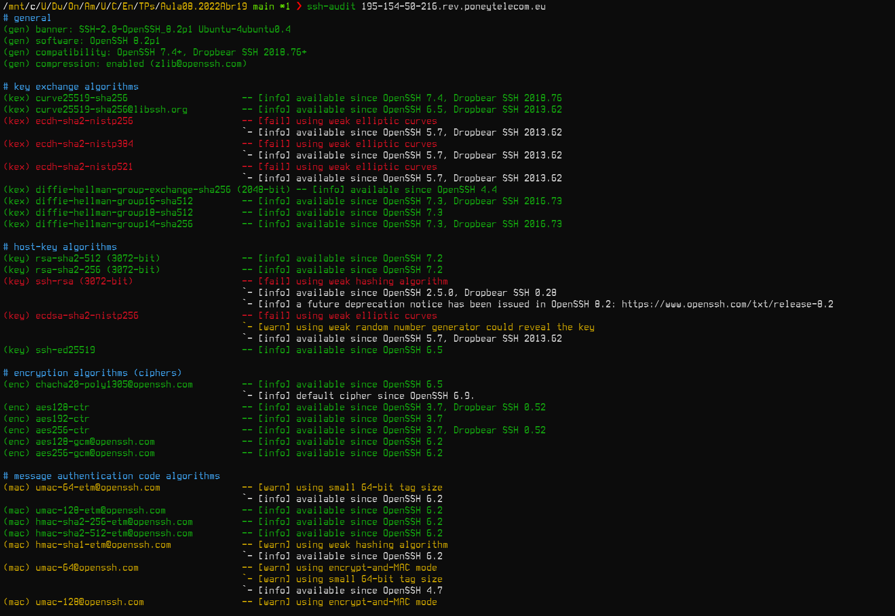
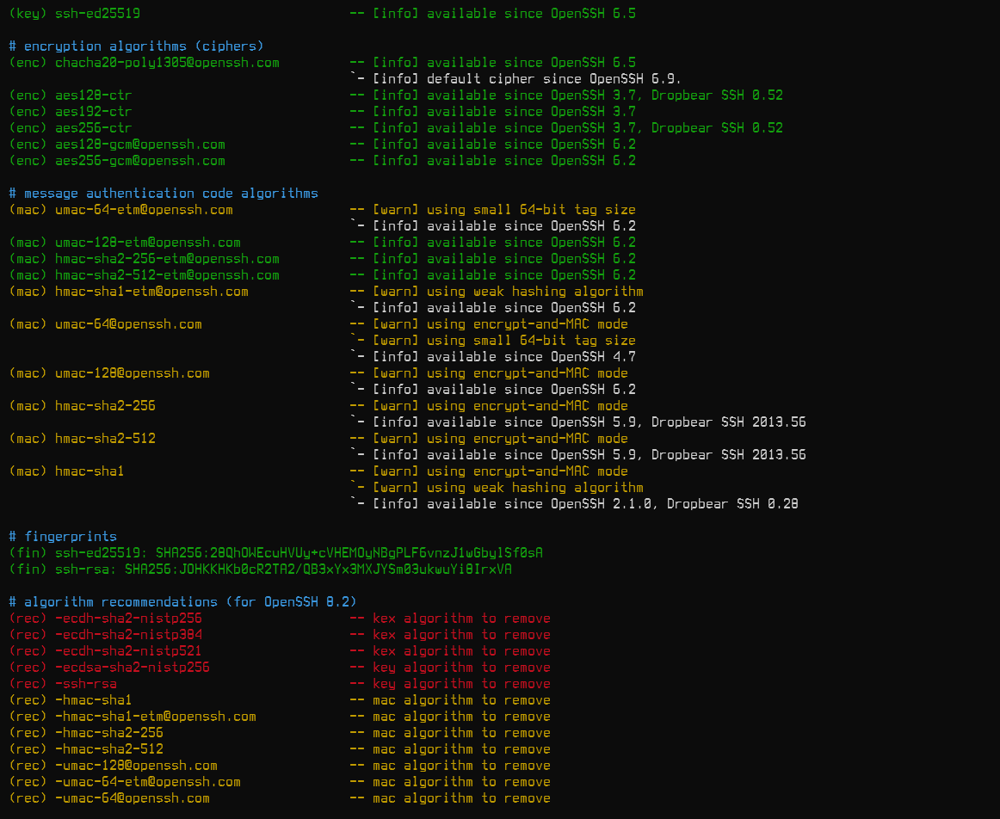

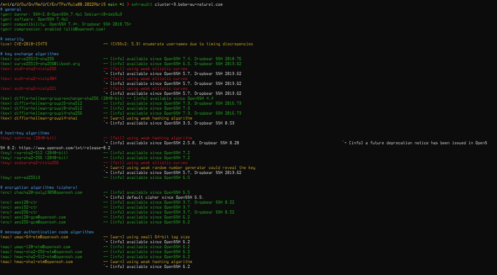
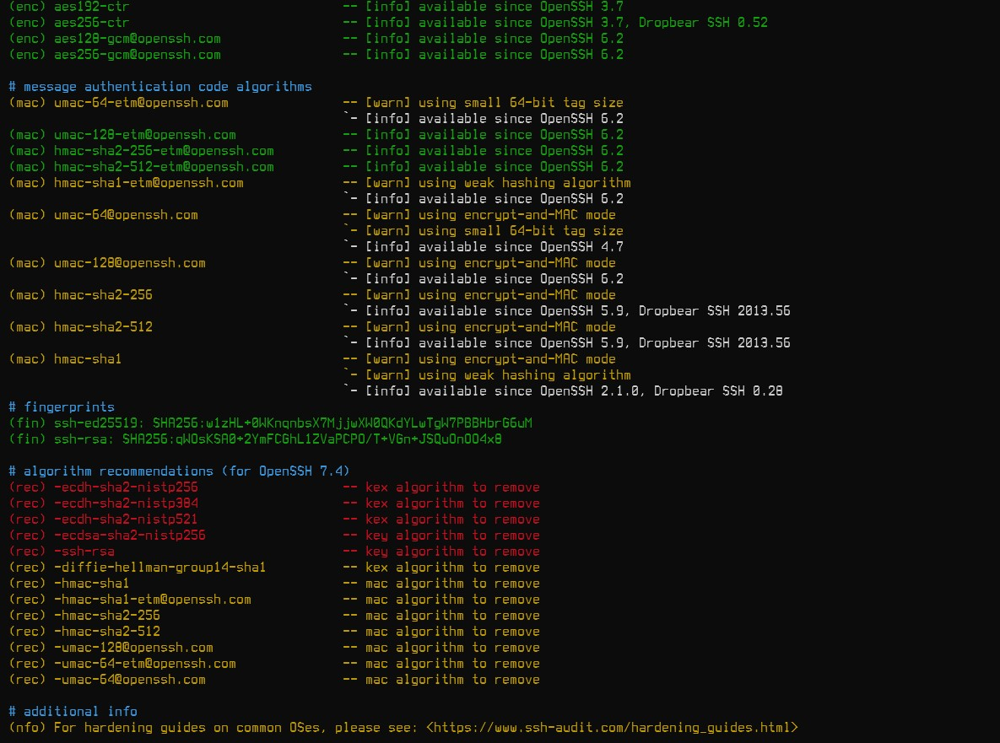

### 2

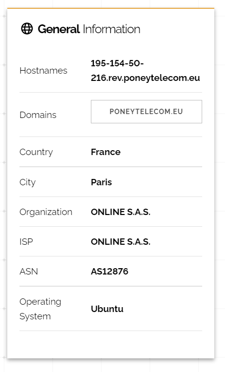

* Empresa: Poney Telecom 
* software: OpenSSH 
* versão : 8.2p1

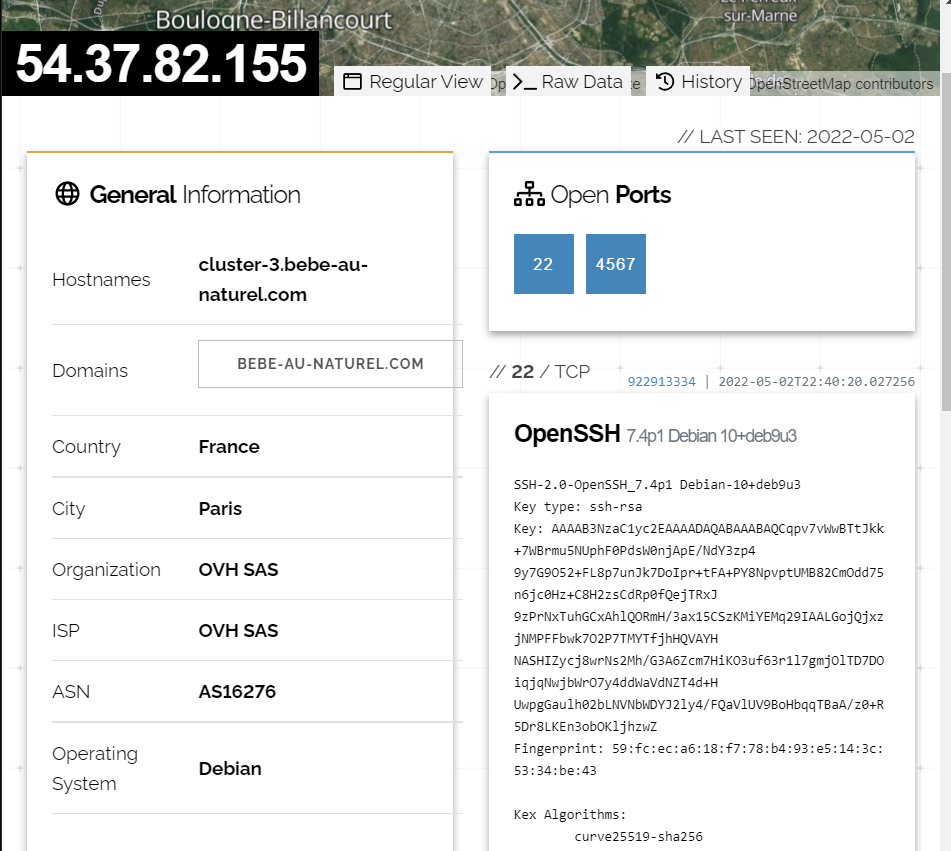

Empresa Comercial 2

* Empresa : Bebe au naturel
* Software : OpenSSH 
* Versão : 7.4p1

### 3

A empresa comercial 1 - ONLINE S.A.S - usando o OpenSSH 8.2p1 tem 6 vulnerabilidades registadas, discriminadas em seguida, com a sua avaliação segundo os parâmetros CVSS:

1. CVSS score : 4.3 -> CVE-2007-2768 - https://www.cvedetails.com/cve-details.php?t=1&cve_id=CVE-2007-2768
2. CVSS score : 4.3 ->  CVE-2016-20012 - https://www.cvedetails.com/cve-details.php?t=1&cve_id=CVE-2016-20012
3. CVSS score : 4.3 -> CVE-2020-14145 - https://www.cvedetails.com/cve-details.php?t=1&cve_id=CVE-2020-14145
4. CVSS score : 6.8 -> CVE-2020-15778 - https://www.cvedetails.com/cve-details.php?t=1&cve_id=CVE-2020-15778
5. CVSS score : 2.6 ->CVE-2021-36368 - https://www.cvedetails.com/cve-details.php?t=1&cve_id=CVE-2021-36368
6. CVSS score : 4.4 -> CVE-2021-41617 - https://www.cvedetails.com/cve-details.php?t=1&cve_id=CVE-2021-41617

A empresa comercial 2 - ONLINE S.A.S -  usando o OpenSSH 7.4p1 tem 14 vulnerabilidades registadas, discriminadas em seguida, com a sua avaliação segundo os parâmetros CVSS:

1. CVSS score : 4.3 -> CVE-2007-2768 - https://www.cvedetails.com/cve-details.php?t=1&cve_id=CVE-2007-2768
2. CVSS score : 5.0 -> CVE-2016-10708 - https://www.cvedetails.com/cve-details.php?t=1&cve_id=CVE-2016-10708
3. CVSS score : 4.3 -> CVE-2016-20012 - https://www.cvedetails.com/cve-details.php?t=1&cve_id=CVE-2016-20012
4. CVSS score : 5.0 -> CVE-2017-15906 - https://www.cvedetails.com/cve-details.php?t=1&cve_id=CVE-2017-15906
5. CVSS score : 5.0 -> CVE-2018-15473 - https://www.cvedetails.com/cve-details.php?t=1&cve_id=CVE-2018-15473
6. CVSS score : 5.0 -> CVE-2018-15919 - https://www.cvedetails.com/cve-details.php?t=1&cve_id=CVE-2018-15919
7. CVSS score : 2.6 -> CVE-2018-20685 - https://www.cvedetails.com/cve-details.php?t=1&cve_id=CVE-2018-20685
8. CVSS score : 4.0 -> CVE-2019-6109 - https://www.cvedetails.com/cve-details.php?t=1&cve_id=CVE-2019-6109
9. CVSS score : 4.0 ->  CVE-2019-6110 - https://www.cvedetails.com/cve-details.php?t=1&cve_id=CVE-2019-6110
10. CVSS score : 5.8 -> CVE-2019-6111 - https://www.cvedetails.com/cve-details.php?t=1&cve_id=CVE-2019-6111
11. CVSS score : 4.3 -> CVE-2020-14145 - https://www.cvedetails.com/cve-details.php?t=1&cve_id=CVE-2020-14145
12. CVSS score : 6.8 -> CVE-2020-15778 - https://www.cvedetails.com/cve-details.php?t=1&cve_id=CVE-2020-15778
13. CVSS score : 2.6 -> CVE-2021-36368 - https://www.cvedetails.com/cve-details.php?t=1&cve_id=CVE-2021-36368
14. CVSS score : 4.4 -> CVE-2021-41617 - https://www.cvedetails.com/cve-details.php?t=1&cve_id=CVE-2021-41617

### 4 

De acordo com a classificação registada no CVE details, ambas têm a vulnerabilidade mais grave, que é a mesma, registada com o código *CVE-2020-15778*, classificada com um valor de **6.8** de acordo com os parâmetros CVSS.
    

### 5

De acordo com o *rating* CVSS, considerando tanto a versão 2.0 desta avaliação com a versão 3.0, esta é uma vulnerabilidade de risco médio, não pondo em causa totalmente os parâmetros que classificam a segurança de informação deste serviço. Desta forma, os seguintes parâmetros caracterizam o risco e paralelamente a gravidade associada a esta vulnerabilidade, a saber:
* O impacto na confidencialidade é parcial, havendo um *leak* considerável de informação.
* O impacto na integridade e funcionamento do serviço é parcial, sendo possível a modificação de ficheiros de sistema ou de informação associada ao sistema, com a atenuante do atacante não ter controlo sobre o que pode ser modificado ou apenas ter controlo limitado sobre o que pode realmente afetar.
* O impacto a nível da disponibilidade do sistema é também parcial, sendo possível registar um nível razoalmente baixo de anomalias a nível de *performance* e interrupções a nível da disponibilidade de determinados recursos.
* Para conseguir explorar este *exploit* é necessário um nível razoável de conhecimento especializado, sendo necessárias também algumas condições favoráveis para se conseguir aproveitar desta falha.
* Finalmente, não é necessária qualquer tipo de autenticação para explorar esta vulnerabilidade, sendo este outro fator negativo que pesa na avaliação da vulnerabilidade.

# Pergunta P3.1

### 1

Não, usando o comando `sudo anonsurf start`, a localização minha localização passou a ser na Alemanha:  
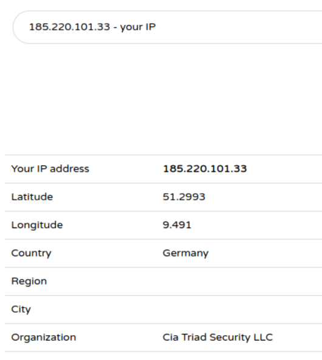  

### 2

Porque a escolha de circuitos TOR é feita pelo *Onion Proxy*, escolhendo os OR a partir da lista fornecida pelo *Directory Server*, ou seja, o circuito é escolhido aleatoriamente.

# Pergunta P3.2

### 1

Circuito TOR para o site https://www.facebookwkhpilnemxj7asaniu7vnjjbiltxjqhye3mhbshg7kx5tfyd.onion/  
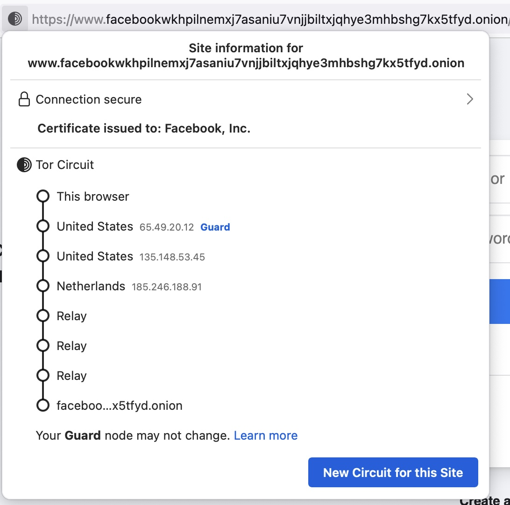  

### 2

Qualquer um dos sites indicados no enunciado são ligações que permitem aceder a um serviço anónimo na rede TOR.
Sabemos que, se quisermos aceder a um serviço anónimo, temos de seguir oa passos do protocolo TOR, que são os seguintes:
+ Na nossa máquina, acedemos aos detalhes do serviço em causa através do *Directory Server*
+ Escolhemos um OR (*Onion Router*) como ponto de *rendezvous*, o RP
+ Construímos um circuito TOR até ao RP
+ Abrimos uma *stream* anónima até um dos *introduction points* do serviço e fornecemos uma mensagem com todas as informações necessárias que será encaminhada para o serviço em causa

Depois de termos um circuito com o RP e termos feito um "pedido" a um ponto de introdução do serviço, cabe ao serviço estabelecer também um circuito com o RP. Assim, o RP conecta os dois circuitos: o escolhido por nós e aquele criado pelo serviço. Este circuito final é normalmente constituído por 6 OR: 3 do nosso circuito e 3 do circuito do serviço. 

No exemplo do serviço disponibilizado no *link* escolhido, podemos ver 6 OR's no circuito TOR, os 3 primeiros fazem parte do caminho escolhido por nós, os restantes 3 são vistos como "*relay*", pois são desconhecidos para nós. Consequentemente, o serviço é anónimo (que é o objetivo) assim como a nossa identidade é desconhecida para o serviço.

### 3

O *rendezvous point* é um OR em **Netherlands** com o IP **185.246.188.91**.

# Pergunta 4.1

Definido na pasta  'Pergunta 4', *main.js*

# Pergunta 4.2

Definido na pasta  'Pergunta 4', *main.js*

# Pergunta 4.3

Dificuldade 2  
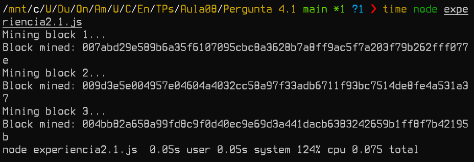  
Dificuldade 3  
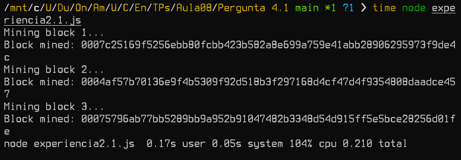  
Dificuldade 4  
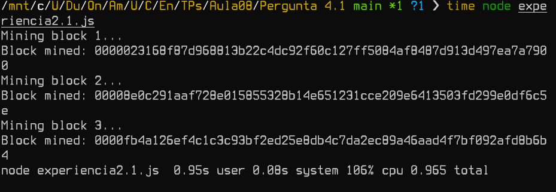  
Dificuldade 5  
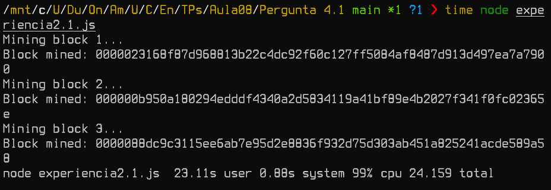  

Pode-se concluir que o aumento do tempo de mineração vai aumentando numa tendência provavelmente exponêncial, visto que se verifica um aumento substâncial do tempo de processamento com o aumento da dificuldade de mineração.

# Pergunta 4.4
### 1
A seguinte imagem caracteriza o algoritmo proof of work associado a esta blockchain, verificando-se a existência de um contador que vai sendo incrementado até ser igual a um número divisível não só por 9 mas também pelo último valor de proof of work válido. Este é o processo computacional associado a esta blockchain e que caracteriza o processo de recompensa pela mineração de blocos. 
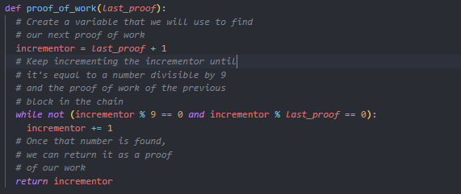

### 2
Tendo em conta que o mecanismo de *proof of work* tem o intuito de ser computacionalmente exigente, de forma a poder ser atribuída uma recompensa ao primeiro miner/participante que descobrir o resultado e que o algoritmo ao "proof of work" considera números divisíveis por 9 e também divisível pelo último valor válido de proof of work. A primeira condição por si só talvez não trouxesse características para que este fosse um algoritmo suficientemente "pesado" para a atribuição de uma recompensa ao *miner*. Agora, a segunda condição traz obviamente uma exigência superior à resolução do algoritmo.
Uma computação ser relativamente rápida pode por em causa o principio basilar do *proof-of-work*, visto que este processo é a solução do problema de representação num mecanismo (por norma muito grande) de *decision making* que envolve o motor de incentivo da blockchain - a atribuição de recompensas aos miners que validam as transações que vão sendo feitas, definindo a criação de diferentes blocos. Assim, apesar da segunda condição trazer uma maior necessidade computacional, se for comparada com outras blockchains cujo proof of work está associado a problemas matemáticos bastante mais exigentes, então pode-se facilmente concluir que numa perspetiva global, este algoritmo não é exigente o suficiente para que haja consenso na rede na atribuição de recompensas.

