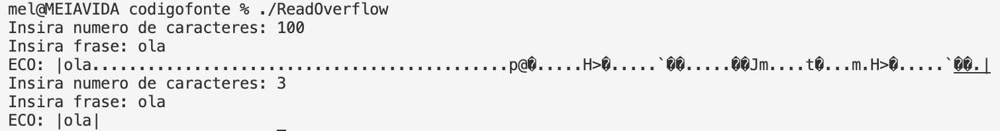

# Pergunta P1.1

A vulnerabilidade de *Buffer Overflow* existente nestes dois programas (`RootExploit.c` e `0-simple.c`) provém do facto de estar a ser usada a função `gets()` que não é segura, devido ao facto de esta não fazer uma verificação do número de caracteres que lê numa linha, como podemos ver pela informação que se encontra no manual da função, ao qual acedemos através do comando `man gets` no terminal:


Para além disto, esta vulnerabilidade também provém do facto de não haver uma verifcação explicíta do tamanho da *string* lida do *stdin*.

**i.** 
Assim, para explorar esta vulnerabilidade no programa `RootExploit.c` e visto que a parte de memória que está a ser usada é a stack, tiramos partido do conhecimento que adquirimos na aula teórica sobre a forma como esta estrutura funciona e, sabendo que a variável *pass* é guardada primeiro na memória e logo abaixo é guardado o *buffer*, e ainda que o *buffer* ocupa 4 *bytes* na stack, a forma de explorar esta vulnerabiliddade é a de introduzir mais de 4 *bytes* quando o programa pede o *input* que será copiado para a o *buffer*, pois, sendo o *input* maior que 4 *bytes*, irá sobrepor os valores dos endereços de memória que estão acima do *buffer* na memória, que é onde se encontra a variável *pass*, fazendo então com que o seu valor (ao qual previamente foi atribuído o 0) se altere, o que faz com que a condição necessária para atribuir as permissões de root/admin seja verdadeira.


**ii.**
Para explorar a vulnerabilidade no programa `0-simple.c` a estratégia foi exatamente a mesma que a anterior, com uma pequena nuance: o gcc tem uma espécie de proteção da stack e, quando tentamos escrever no *input* mais que 64 *bytes*, pois esta é a quantidade de memória usada pelo *buffer* neste programa, era obtida a seguinte mensagem:

```
*** stack smashing detected ***: terminated
```

Então, para ultrapassar esta barreira, depois de alguma pesquisa, percebemos que teríamos que compilar o programa com a opção `-fno-stack-protector`, que "desliga" esta proteção que o gcc tem por defeito para a stack. Depois de compilarmos o programa desta forma, já foi possível explorar a vulnerabilidade com alguma facilidade, como podemos ver no seguinte *screenshot*.


# Pergunta P1.2

Analisando o código fonte deste programa e também o seu comportamento, podemos concluir que a verificação do tamanho de caracteres a ser introduzido que está a ser feita no programa não é muito segura, pelo facto de ser o utilizador a dizer qual será o número de caracteres que irá introduzir, portanto, nada impede de que um utilizador malicioso introduza menos caracteres do que aqueles que disse que iria introduzir e, neste caso, o programa irá escrever na mesma no "ECO" o número total de caracteres, ou seja, outros dados que estejam na memória.




# Pergunta P1.3

Podemos ver, analisando o código fonte do programa, que em nenhum momento de execução do programa é feita uma verificação dos limites das variáveis `dummy` e `readonly`. Vemos ainda que a função usada para fazer a atribuição de valores às variáveis é a função `strcpy(char * dst, const char * src)`. Sabemos, por aquilo que foi dado nas aulas teóricas, que o *C* tem outra função de cópia de *strings* `strncpy(char * dst, const char * src, size_t len)`, que faz o mesmo que a anterior com a nuance de que copia, no máximo, len caracteres da *string* origem para a destino.

Se utilizarmos, então, a função `strncpy` em vez de `strcpy` para a cópia do parâmetro de entrada do programa para a variável `dummy` e definirmos `len` como sendo 10 caracteres, que é a quantidade de caracteres correspondente à memória alocada, a vulnerabilidade de *buffer overflow* deixa de existir, pois mesmo que o utilizador introduza mais do que 10 caracteres, apenas 10 serão efetivamente lidos e atribuídos ao valor da variável. 

A seguir apresentamos o código alterado:

```c
#include <stdio.h>
#include <string.h>
#include <stdlib.h>

int main(int argc, char **argv) {
    char *dummy = (char *) malloc (sizeof(char) * 10);
    char *readonly = (char *) malloc (sizeof(char) * 10);
    
    strcpy(readonly, "laranjas");
    strncpy(dummy, argv[1],10);
    printf("%s\n", readonly);
}
```


# Pergunta P1.4

Tal como na pergunta anterior, substituímos a função `strcpy` pela `strncpy` que apenas permite a cópia de um valor máximo de caracteres, desta forma, são preservados os limites do *buffer*.

O código com as alterações está no ficheiro [stack.c](stack.c).


# Pergunta P2.1

**1.**
A vulnerabilidade existente é a de *integer underflow*. Esta vulnerabilidade ocorre quando o valor atribuído a um inteiro é menor do que o mínimo valor permitido, normalmente quando esse valor é o resultado de uma subtração. Quando isto acontece, o valor que é produzido e atribuído à variável é um diferente do valor correto, normalmente um valor positivo extremamente grande, próximo do máximo valor inteiro permitido.

**2.**
```c
int main() {
        vulneravel("Olá!",0);
}
```
Desta forma, o valor da variável `tamanho` na função `vulneravel()` será 0, depois, a este valor será subtraído o valor 1, como se trata de variáveis do tipo `size_t`, em que o valor mínimo é 0, a subtração de 0 com 1, que daria o resultado `-1`, dará como resultado um valor extremamente grande, possivelmente o valor máximo permitido.

**3.**
Sim:
```
mel@MEIAVIDA Aula12.b % ./underflow                 
zsh: segmentation fault  ./underflow
```

**4.**
Para mitigar esta vulnerabilidade, alteramos a condição do `if`, adicionando uma verificação de que o valor de `tamanho` é maior que 0. Desta forma, a subtração nunca será menor que o valor mínimo permitido.

A seguir apresentamos o código alterado:
```c
#include <stdio.h>
#include <stdlib.h>
#include <string.h>

const int MAX_SIZE = 2048;


void vulneravel (char *origem, size_t tamanho) {
        size_t tamanho_real;
        char *destino;
        if (tamanho < MAX_SIZE && tamanho > 0) {
                tamanho_real = tamanho - 1; // Não copiar \0 de origem para destino
                destino = (char *) malloc(tamanho_real);
                memcpy(destino, origem, tamanho_real);
        }
}

int main() {
        vulneravel("Olá!",0);
}
```